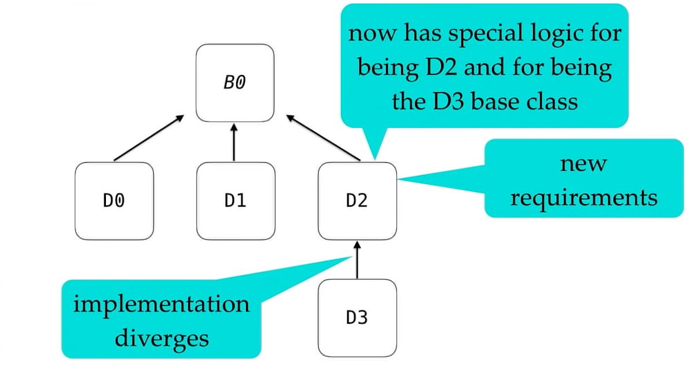
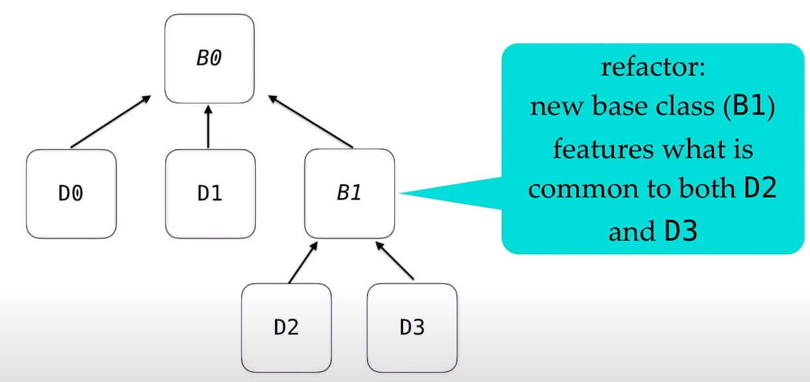

# Object Oriented Programming
----

[source vid](https://www.youtube.com/watch?v=32tDTD9UJCE&t=1099s) 

----


## OOP models "is-a" relationships

**base class** : an API , a guarantee we made to customer of this object that cares 
nothing about implementations

**derived class** : different implementations


### code for base class and derived class

```cpp
// base class : common features that all logger has
struct Logger {
	virtual void LogMessage(char const* message) = 0;
	virtual ~Logger() = default;
};

// derived class : special implementation with console
struct ConsoleLogger final : Logger {
	virtual void LogMessage(char const* message) override {
		std::cout << message << "\n";
	}
};

// derived class : special implementation with file
struct FileLogger final : Logger {
	FileLogger(char const* filename): m_output(filename) {}
	virtual void LogMessage(char const* message) override {
		m_output << message << "\n";
	}
private:
	std::ofstream m_output;
};
```

### use base pointer refer to specific implementation

```cpp
void runtimeDispatch() {
	auto logger{std::make_unique<ConsoleLogger>()}; // use a base class pointer to point to derived class obj
	Logger* loggerPtr{logger.get()};
	loggerPtr->LogMessage("Hello World");           // declare virtual will trigre run time dispatch
}
```

### encapsulate implementation details from lib user

the programmer implement LogHelloWorld need not to concern which log method is used,
he only cares that the message will be logged correctly with some logger.

In other word, the difference between different implementations is encapsulated 
by dynamic dispatching , and the promises made by base class is kept.

```cpp
void LogHelloWorld(Logger& logger) {
	logger.LogMessage("Hello, World!");
}

int main() {
	auto cliLogger{ConsoleLogger{}};
	auto fileLogger{FileLogger{"logfile.txt"}};

	LogHelloWorld(cliLogger);
	LogHelloWorld(fileLogger);

}

```

### Inheritance

Powerful hierarchies are built on well-defined abstractions

> Use OOP to model "is-a" relationships, not for code reuse.

## Make non-leaf classes abstract

```cpp
Lizard liz1;
Lizard liz2;

Animal *pAnimal1 = &liz1;
Animal *pAnimal2 = &liz2;

*pAnimal1 = *pAnimal2; // slicing happens
```

### GuideLine: Make non-leaf classes abstract

1. Make every class in your hierarchies either a base-only or a leaf-only.


> give one entity one cohesive responsibility. 

So we should not introduce new requirement(abstractions) within a non-base class.


2. Make bases:
    1. abstract
    2. protected assignment operators

3. Make leaf classes:
    1. concrete
    2. public assignment operators
    3. final

## Use Nonvirtual Interface Idion(NVI)

> Consider alternatives to virtual functions        ---Scott

> Consider making virtual functions nonpublic, and public functions nonvirtual  ---Herb

```cpp
struct Logger {
    virtual void LogMessage(char const* message) = 0;
    virtual ~Logger = default;
};

struct NVILogger {
    void LogMessage(char const* message) {
        // Preperation
        DoLogMessage(message);
        // Clean up
    }

    virtual ~Logger() = default;

private:
    virtual void DoLogMessage(char const* message) = 0;
};
```

1. Base class in control
    1. enforce pre/post conditions
2. Robust in the face in the change
3. Each interface can take it's natural shape

## Implementation Issues(Build)

> 1: Overriden functions must be declared virtual.

> 2: Always make base class destructors virtual

> 3: Override will enforce compiler checking and can inform user.

### Scoping Problem
Inner scope declarations hide declarations in outer scope

> 4: the scope of derived class is consider inside the base class

Overloading Functions Rules:
1. look for called name in scope(rather than signature)
2. if found:
    1. collect all condidates in scope
    2. stop
3. else:
    1. move to next outer scope
    2. go to #1

> 5: don't mix overloading with overriding(when we dereference)

In the following example : no overriding happens, only overloading

```cpp
struct base {
    virtual int foo(int x) {return 0;}

};

struct derived : base {
    auto foo(long x) {return 1;}
    auto foo(double x) {return 1;}

    derived(  ) {
        std::cout << foo(0) << '\n';
        std::cout << foo(0L) << '\n';
        std::cout << foo(0.0) << '\n';
    }
}
```

### Default parameter values

default parameter declared at base class functions' signature will not be overriden by derived class functions

> 6: don't specify default parameter in derived functions

### No dispatch in constructor and destructor
> 7: don't call virtual functions in constructor / destructor

### upcasting / downcasting

upcasting is always safe , while downcasting not.  
But what if we need to access some derived functions that is not defined in the base class ( implementation specific attribute )

Possible Solutions:

1. use dynamic cast rather than static cast when downcasting and check for failure.

2. don't introduce implementation specific function without define a virtual function in base class

> 8: use dynamic rather than static casts for downcasting , but avoid casting by refactoring where possible.


